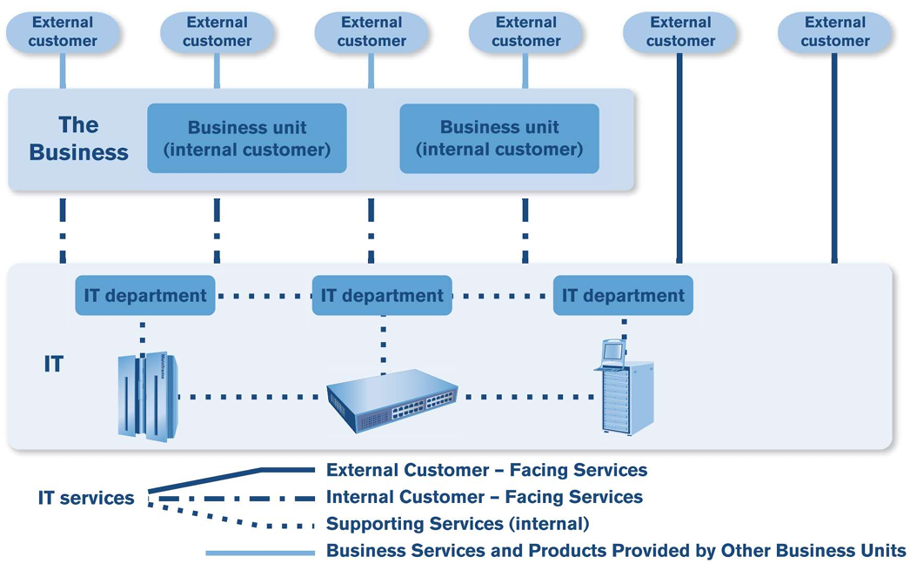

# Service Management: Key Concepts

- Service Management as a Practice
  - Business and IT
  - Definition of Service Management
  - Stakeholders in Service Management
  - What is IT?
  - The IT Organization
  - Definition of Service
  - Service Offering and Service Relationships
  - Output, Outcome, Cost, and Risk
  - Service Value = Utility and Warranty
  - Practice
  - Process Model
  - Characteristics of Processes
- ITIL
  - History
  - ITIL4 Key Concepts

## Business and Information Technology

- Information has become a value in itself
- IT aids existing Businesses by increasing efficiency and effectiveness
- IT enables new types of Business

### The World is Changing

- Speed of Business increases
- Globalization and lower transaction costs redifine Business
- Business models

### Business/IT Alignment

- Customer of IT (the Business) requires IT Services that continuously support their Business needs
- IT should be aware of rapid Changes in Business
- **Internal providers** face possible **outsourcing** and must run their IT as a Business

### Why is ITIL successful?

- ITIL embraces a practical approach to service by adapting a common framework of practices that unite all areas of IT service provision towards a single aim — that of delivering value to the business;
- Vendor-neutral ITIL service management practices are applicable in any IT organization because they are not based on any particular technology platform or industry type.
- Non-prescriptive ITIL offers robust, mature and time-tested practices that have applicability to all types of service organizations. It continues to be useful and relevant in public and private sectors, internal and external service providers, small, medium and large enterprises, and within any technical environment
- Best practice ITIL represents the learning experiences and thought leadership of the worlds best-in-class service providers

### Adoption of a Good Practice

- Business Requirements
- Dynamic Environemt
- Sourcing Strategy

### Service Management Practice

Drivers: Something that motivates the organization to do something
Scenarios: Situations where the drivers might happen
Sources: Sources of practices of Service Management
Enablers: People and Technologies that apply Service Management

#### Sources

- Standards (ISO/IEC 20000)
- Industry Practices
- Academic Research
- Training & Education
- Internal Experience

#### Enablers

- Employees
- Customers
- Suppliers
- Consultants
- Technologies

#### Drivers

- Substitutes
- Regulators
- Customers

#### Scenarios

- Competition
- Compliance
- Commitments

## Definition of IT Service Management

- Service Management: Aset of specialized organizational capabilities for enabling value to customers in the form of services
- Service provider: A role performed by an organization in a service relationship to provide services to consumers
- IT service management (ITSM): The implementation and management of quality IT services that meet the needs of the business.
  - IT service management is performed by IT service providers through an appropriate mix of **people**, **process** and **information technology**

### Benefits of Service Management

- Improved quality Service provision
- Cost justifiable Service quality
- Services that meet Business, Customer and User demands
- Everyone knows their role and knows their responsibilities in Service provision

### Service Management Challenges

- Intangible nature of the output
- Demand is tightly-coupled with Customer's assets
- High-level of contact for producers and consumers of Services
- The perishable nature of Service output and capacity

## Stakeholders in service management

- **Stakeholders** have an interest in an organization, project or service etc. and may be interested in the activities, targets, resources or deliverables from service management
- Within the service provider organization there are many different stakeholders including the functions, groups and teams that deliver the services

- Service Consumer Roles (external stakeholders)
  - Customer: A person who defines requirements for services and takes responsibility for outcomes from service consumption
  - User: A person who uses services
  - Sponsor: A person who authorizes the budget for service consumption
- Suppliers - A stakeholder responsible for providing services that are used by an organization.
  - Suppliers are internal or third parties, responsible for supplying goods or services that are required to deliver IT services
    - Examples of suppliers include: commodity hardware and software vendors, network and telecom providers, and outsourcing organizations

## What is Information Technology (IT)?

IT changes meaning with context:

- IT as an "**Organization**"
- IT as a "**Component**"
- IT as a " **Service**"
- IT as an "**Asset**"

## Service Provider IT as an Organization

Customers can get Services from three types of Service Providers

- Internal Service Providers
- External Service Providers
- Shared Services Unit

## Definition of a service

"Services are a means to create/enable value by facilitating outcomes that customers would want to achieve without having to manage the costs and risks"

"People want a quarter inch hole, not a quarter inch drill"

Prof T. Levitt, Harvard Business School

## Service Offerings

Description of one or more services, designed to address the needs of a target consumer group.

Service offerings may include goods, access to resources and service actions:

| Goods                                        | Access to Resources                                         | Service Actions                                      |
| -------------------------------------------- | ----------------------------------------------------------- | ---------------------------------------------------- |
| Ownership is transferred to the consumer     | Ownership is not transferred to the consumer                | Performed by the provider to address a consumer need |
| Consumer takes responsibility for future use | Access is granted/licensed under agreed terms or conditions | Performed according to agreement with consumer       |
| A mobile phone A physical server             | Access to the mobile network, or to network storage         | User support Replacement of a piece of equipment     |

## Service Relationship

A cooperation between a service provider and service consumer.

Service relationships include service provision, service consumption and service relationship management.

<table>
  <thead>
    <tr>
      <th>Service Provision</th>
      <th>Service Consumption</th>
      <th>Service Relationship Management</th>
    </tr>
  </thead>
  <tbody>
    <tr>
      <td>Management of provider resources configured to deliver the service</td>
      <td>Management of the consumer resources needed to consume the service</td>
      <td rowspan=4>Joint activities performed by a service provider and a service consumer to ensure continual value co-creation based on agreed and available service offerings</td>
    </tr>
    <tr>
      <td>Provision of access to resources for users</td>
      <td>Utilization of the provider’s resources</td>
    </tr>
    <tr>
      <td>Fulfillmentof the agreed service actions</td>
      <td>Requesting service actions to be fulfilled</td>
    </tr>
    <tr>
      <td>Service performance management and continual improvement</td>
    </tr>
  </tbody>
</table>

## IT as a Service - Output, Outcome, Cost and Risk

Customers seek outcomes but do not wish to manage all the associated specific costs and risks

**Output:** A tangible or intangible deliverable of an activity

**Outcome:** A result for a stakeholder enabled by one or more outputs

**Cost:** The amount of money spent on a specific activity or resource:

- Costs removed from customer (part of value)
- Costs imposed on customer (costs of consumption)

**Risk:** Possible event that could cause harm or hinder achievement of objectives. (Uncertainty of outcome.)  
Can be seen as:

- Risks removed from the customer (part of value)
- Risks imposed on customer (risks of consumption)

## Service Value Definition

## Internal and External Customers and Services

Just as there are internal and external customers, there are internal and external services

<!-- TEMP IMAGE SWAP LATER -->

