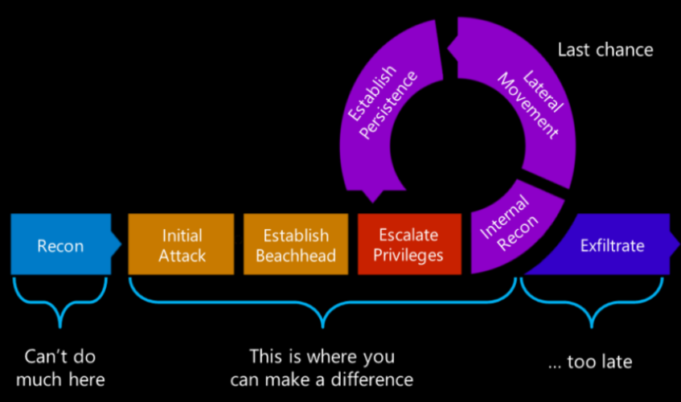

# Introduction to Applied Cybersecurity

## 1. Notion of AP Cyber

Often referred to the application of technologies, processes and practises used to protect important assets from unauthorized access or damage.
Includes a wide range of activities (not just technology) such as risk management, incident response, disaster recovery, network security and compliance with regulation. Firewalls, intrusion detection systems and multi-factor authentication are often used to prevent cyber threats.

## 1.1 Why is it important?

To cover topics such as:

- Cybersecurity fundamentals
- Risk management
- Network security
- Data protection
- Compliance and regulations

## 1.2 NIST framework

The National Institute of Standards and Technology Cybersecurity Framework was developed to help organization manage their cyber risks. Provides elaborate guidelines and standards for companies to follow.

- Identify: Helps organizations understand their assets and risks
- Protect: Dedicated to preventing cyber threats from compromising systems and data
- Detect: Helps organization detect potential incidents as soon as possible
- Respond: Guides organizations on how to respond to cybersecurity incidents
- Recover: Helps companies recover after an incident and return to normal function

## 1.3 Kill chain

1. Reconnaissance: The attacker collects information about the target system and its vulnerabilities
2. Weaponization: The attacker creates the tools necessary to execute the attack, such as malware, exploits, or payloads
3. Delivery: The attacker delivers the weaponized payload to the target system, such as through email, phishing, or network intrusion
4. Exploitation: The attacker takes advantage of the vulnerabilities in the target system to gain access and control (we can start escalating privilege meaning starting at a person with admin privilege you can access whole system)
5. **(In red)** After privilege escalation you should do another internal reconnaissance
6. Installation: The attacker installs malware or other tools on the target system to maintain access and control
7. Command and control: The attacker establishes communication with the malware on the target system to issue commands and receive data
8. Actions on objectives: The attacker achieves their goals, such as stealing data, disrupting operations, or damaging the system
