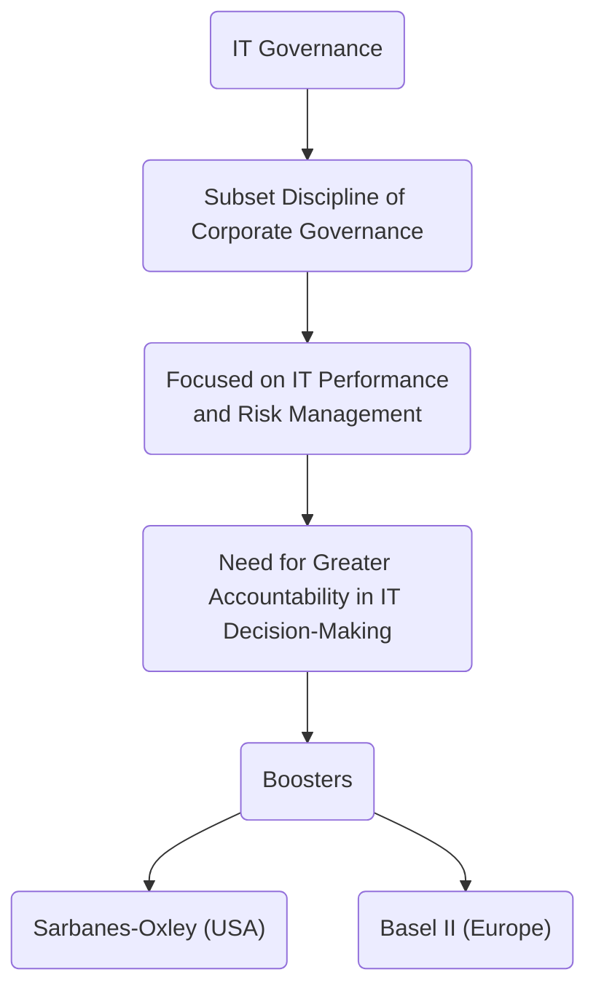
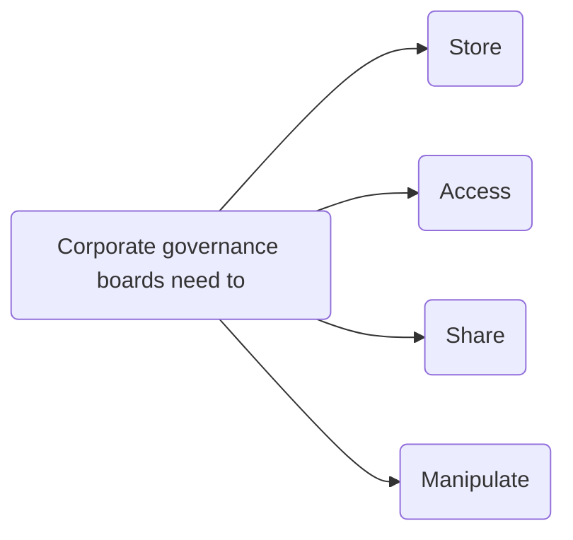

# Chapter 1 - IT Governance Defined

“Corporate governance is the set of processes, customs, policies, laws, and institutions affecting the way a corporation (or company) is directed, administered or controlled, including the relationships among the many stakeholders involved and the goals for which the corporation is governed.” - Principles of Corporate Governance, OECD, 2004

"IT governance is the responsibility of executives and the board of directors, and consists of the leadership, organisational structures and processes that ensure that the enterprise’s IT sustains and extends the organisation’s strategy and objectives." - IT Governance Institute, 2005

## Why IT Governance?

"While in the past, business executives could delegate, ignore, or avoid IT decisions, this is now impossible in most sectors and industries" - Peterson, 2003; Duffy, 2002a; Van Der Zee & De Jong, 1999

### Consequences of IT Failures

- Business losses and disruptions
- Damaged reputations and weakened competitive positions
- Schedules not met, higher costs, poorer quality, unsatisfied customers

### Examples of top class negatively impacted by poor quality of IT deliverables

- Nike lost an estimated $200 million while running into difficulties installing a supply chain software system;
- Hershey attempted to install SAP several years ago and was not successful;
- Whirlpool fail in implement a supply chain management system which did not provide accurate inventory counts at various inventory stages;
- A publicly traded company admitted that a virtual collapse of its financial reporting system reduced its market value by one-third in a single day

## Emergence of IT Governance

