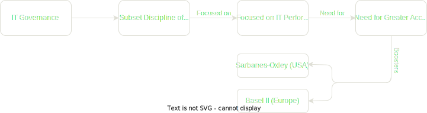
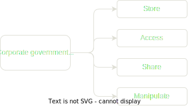

# Chapter 1 - IT Governance Defined

“Corporate governance is the set of processes, customs, policies, laws, and institutions affecting the way a corporation (or company) is directed, administered or controlled, including the relationships among the many stakeholders involved and the goals for which the corporation is governed.” - Principles of Corporate Governance, OECD, 2004

"IT governance is the responsibility of executives and the board of directors, and consists of the leadership, organisational structures and processes that ensure that the enterprise’s IT sustains and extends the organisation’s strategy and objectives." - IT Governance Institute, 2005

## Why IT Governance?

"While in the past, business executives could delegate, ignore, or avoid IT decisions, this is now impossible in most sectors and industries" - Peterson, 2003; Duffy, 2002a; Van Der Zee & De Jong, 1999

### Consequences of IT Failures

- Business losses and disruptions
- Damaged reputations and weakened competitive positions
- Schedules not met, higher costs, poorer quality, unsatisfied customers

### Examples of top class negatively impacted by poor quality of IT deliverables

- Nike lost an estimated $200 million while running into difficulties installing a supply chain software system;
- Hershey attempted to install SAP several years ago and was not successful;
- Whirlpool fail in implement a supply chain management system which did not provide accurate inventory counts at various inventory stages;
- A publicly traded company admitted that a virtual collapse of its financial reporting system reduced its market value by one-third in a single day

## Emergence of IT Governance

**Information Technology (IT)**

- Became critical for all organisations of any scale
- Value and importance of intellectual assets have become significant
- Need to respond to business and IT rapidly changing competitive and environmental pressures
- Need to extend the core governance principles (strategic aims and leadership, monitoring performance of management, reporting)

"Firms with superior IT governance had 20% higher profits than firms with poor Governance given the same strategic objectives." - Dr. Peter Weill, MIT (Based on a study of 250 enterprises in 23 countries)

| Corporate Governance Questions                                                                                                                             | IT Governance Questions                                                                                                |
| ---------------------------------------------------------------------------------------------------------------------------------------------------------- | ---------------------------------------------------------------------------------------------------------------------- |
| How do suppliers of finance get managers to return some of the profits to them?                                                                            | How do the board and executive management get their CIO and IT organisation to return some business value to them?     |
| How do the board and executive management make sure that their CIO and IT organisations do not steal the capital they supply or invest it in bad projects? | How do suppliers of finance make sure that managers do not steal the capital they supply or invest it in bad projects? |
| How do suppliers of finance control managers?                                                                                                              | How do the board and executive management control their CIO and IT organisation?                                       |

## IT Governance vs IT Management

### IT Management Focus

- Effective and efficient internal supply of IT
  services and products
- Management of present IT operations

### IT Governance Focus

- Broader than IT management
- Concentrates on performing and transforming IT to meet present and future demands of the business (internal focus) and business customers (external focus)

| IT Governance Committee                                            | IT Management Committee                                                         |
| ------------------------------------------------------------------ | ------------------------------------------------------------------------------- |
| Approve the 18-month plan                                          | Prioritise and implement IT projects on an 18 month plan                        |
| Approve IT funding                                                 | Recommend an IT plan to the IT governance executive committee                   |
| Approve IT policies                                                | Resolve issues (e.g., resourcing, systems integration, cross-functional issues) |
| Audit IT Operations                                                | Perform and Control IT Operations                                               |
| Ensure alignment between the IT plan and the organisation strategy | Ensure that requests for IT projects have a business case                       |
| Ensure the money spent on IT brought value to the organisation     | Create criteria to determine the value of IT projects                           |
| Resolve issues beyond the mandate of the IT management committee   | Undertake required issues requested by the IT Governance committee              |

## IT Governance Frameworks

ISO/IEC 38500 (published in 2015) recognises that, in smaller organisations, the members of the governing body may also have roles in management

Any effective IT governance framework includes a number of management systems, standards and methodologies that may help an organisation structure its approach to IT governance
Examples:

- ISO/IEC 38500
- Control Objectives for Information Technology (COBIT@)
- ISO 9001
- ISO 20000
- IT Infrastructure Library (ITIL@)
- ISO/IEC 27001 (2005)
- PRINCE2TM, PMBoK, Agile

"Corporate Governance is concerned with the way corporate entities are governed, as distinct from the way businesses within those companies are managed."

Professor Andrew Chambers, in Tottel's Corporate Governance; Handbook, Tottel Publishing, 2003

## The five major drivers of IT Governance

1. Search for competitive advantage
   through intellectual assets, information and IT
2. Rapidly evolving governance requirements across the Organisation for Economic Co-operation and Development
3. Increasing information and privacy-related legislation (IT regulatory compliance)
4. Threats to intellectual assets, information and IT (need for security and business continuity)
5. The need to align technology projects with strategic organisational goals, ensuring that they deliver planned value (project governance)

## Successful IT Governance Critical Pillars

- Leadership, Organization, Decision Rights and Metrics - defines the organization structure, roles and responsibilities, decision rights, a shared vision and meaningful metrics.
- Flexible and Scalable Processes – the IT governance model places heavy emphasis on the importance of process implementation and improvement
- Enabling Technology – Leverage leading tools that support the key IT governance components

## Value Propositions for Governance from Best-in-Class Companies

- Lowers cost of operations by accomplishing more work consistently in less time and with fewer resources without sacrificing quality (GM)
- Provides better control & more consistent approach to governance, prioritization, development funding and operations (Kodak)
- Develops a better working relationship and communications with the customer (Nortel)
- Aligns initiatives and investments more directly with business strategy (GE)
- Facilitates business & regulatory compliance with documentation & traceability as evidence (Purdue Pharma)
- Reuse of consistent & repeatable processes helps to reduce time and costs & speeds up higher quality deliverables (IBM)

“Firms with superior IT governance had 20% higher profits than firms with poor Governance given the same strategic objectives”

Dr. Peter Weill, MIT (study of 250 enterprises in 23 countries)

<table>
  <thead>
    <tr>
      <th></th>
      <th>IT Decision</th>
      <th>Senior Management's Role</th>
      <th>Failure Consequence</th>
    </tr>
  </thead>
  <tbody>
    <tr>
      <td rowspan="3">Strategy</td>
      <td>How much should we spend on IT</td>
      <td>
        Define the strategic role that IT will play in the company and then
        determine the level of funding needed to achieve that objective
      </td>
      <td>The company fails to develop an IT platform that furthers its strategy, despite high IT spending</td>
    </tr>
    <tr>
      <td>Which business processes should we include on IT budget</td>
      <td>
        Make clear decisions about which IT initiatives will or will not be funded
      </td>
      <td>A lack of focus overwhelms the IT unit, which tries to deliver many projects that may have little company wide value or can’t be implemented well simultaneously</td>
    </tr>
    <tr>
      <td>Which IT capabilities should be outsourced</td>
      <td>
        Decide which IT capabilities should be provided centrally and which should
        be developed by individual businesses
      </td>
      <td>The company may pay for service options that, given its priorities, aren’t worth the costs</td>
    </tr>
    <tr>
      <td rowspan="3">Execution / Operation</td>
      <td>How good do our IT services really need to be</td>
      <td>
        Decide which features—for example, enhanced reliability or response
        time—are needed on the basis of their costs and benefits
      </td>
      <td>Excessive technical and process standardization limits the flexibility of business units, or frequent exceptions to the standards increase costs and limit business synergies</td>
    </tr>
    <tr>
      <td>What security and privacy risks will we accept</td>
      <td>
        Lead the decision making on the trade-offs between security and privacy on one hand and convenience on the other
      </td>
      <td>An overemphasis on security and privacy may inconvenience customers, employees, and suppliers; an underemphasis may make data vulnerable</td>
    </tr>
    <tr>
      <td>Whom should we blame if an IT initiative fails</td>
      <td>
        Assign a business executive to be accountable for every IT project;
        monitor business metrics
      </td>
      <td>The business value of systems is never realized</td>
    </tr>
  </tbody>
</table>
