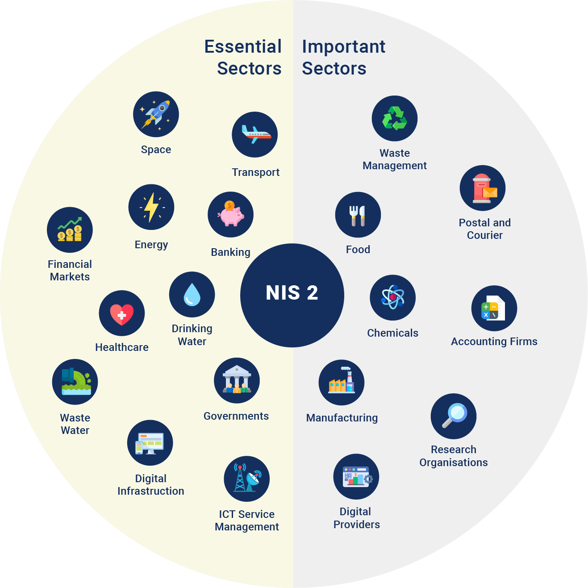
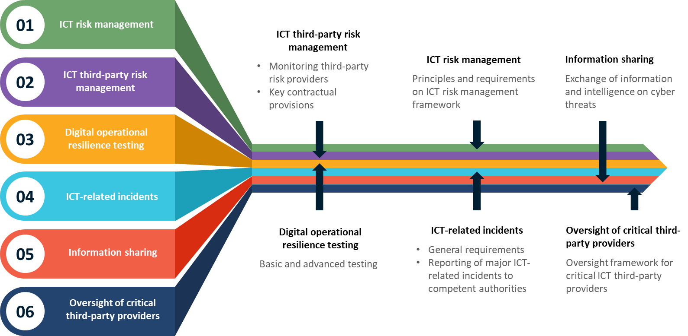

# Chapter 5: IT Regulatory Compliance

## Regulations

- Legislation promulgated by a state, federal or local administrative agency
- Specific in nature
- Referred to as "rules" or simply "administrative law"

### Most prominent regulations

- Anti-Bribery
- AI Act
- NIS2
- GDPR
- Basel III
- Computer Misuse Act 1990
- Data Protection Act 1998
- FFIEC - Federal Financial Institutions Examination Council
- Financial Services Authority (FSA)
- FINRA - The Financial Industry Regulatory Authority
- HIPAA - Health Insurance Portability and Accountability Act
- Markets in Financial Instruments Directive (MiFID)
- MAS - Monetary Authority of Singapore
- OCC - Office of the Controller of the Currency
- Payment Card Industry – Data Security Standard (PCI DSS)
- Sarbanes-Oxley Act
- SEC - Securities and Exchange Commission
- UK Corporate Governance Code

Common element: Any access to confidential or third party data must be audited and controlled

Every business should be governed by regulations of which at very least, its minimum requirements must be met

**Compliance to Regulations**  
The action or fact of complying with a law ([Regulations](#regulations)) or recommended industry standard ([Standards](#standards) or [Best Practices](#best-practices))

## Best Practices

- Methods and techniques that have consistently shown results superior than those achieved with other means, and which are used as benchmarks to strive for. - There is, however, no practice that is best for everyone or in every situation, and no best practice remains best for very long as people keep on finding better ways to of doing things.

## Standards

- Documented agreements
- Contains technical specifications
- Contains rules, guidelines or definitions of characteristics
- Ensure that processes and services fit for their purpose

## Sarbanes-Oxley Act of 2022 (SOX)

"An Act to protect investors by improving the accuracy and reliability of corporate disclosures made pursuant to the securities laws, and for other purposes."

- Legislation enacted in response to the high-profile financial scandals to protect shareholders and the general public from accounting errors and fraudulent practices in the enterprise.
- Administered by the Securities and Exchange Commission (SEC), which sets deadlines for compliance and publishes rules on requirements.
- Defines which records are to be stored and for how long.

With senior management liability up to $5M and 20 years in jail, this is probably the regulation that has received the most publicity in the last years.

### Motivators

- A number of high-profile incidents across some of the world's biggest accounting firms
- Financial scandals
- Negligent fraud detection
  - It is estimated that prior to SOX, only 33% of frauds were discovered

### Objectives

- Mitigate business risk
- Prevent fraud or ensure that there are ways to identify them when they occur
- Ensure transparency in Corporate Governance.
- Increase the independence and accuracy of auditing and corporate governance
- Protect investors and the stock market
- Restore the stock-holder’s confidence on markets

### Advantages

- Standardization
- Transparency
- Formalization of internal controls
- Increased financial credibility
- Provide of Code of ethics
- Decreasing costs
- Gains in efficiency
- Audit reliability

### Critics

- High implementation costs
- Lower risk appetite
- Bureaucratized processes
- Led many companies to the London Stock Exchange

### Impact of SOX on IT Audits

The legislation not only affects the financial side of corporations, it also affects the IT departments (operations, processes, security, etc.) whose job it is to store a corporation's electronic records.

All business records, including electronic records and electronic messages, must be saved for "not less than five years.”

**IT Auditor**

- Assure internal control, quality and integrity of information generated by IT systems
- Assure that the IT system comply with the legal and regulatory requirement

## Most Common Mechanisms

### Decision Making Structures

- Business/IT relationship managers
- IT leadership committee comprising IT executives
- Capital approval committee

### Communication Approaches

- Office of IT Governance

### Alignment Process

— Service Catalogue
— Service-level agreements
— Chargeback arrangements
— Architecture exception process
— Tracking of IT projects

## NIS2 Directive

The Directive (EU) 2022/2025 on measures for a high common level of cybersecurity across the Union is the first EU horizontal legislation addressing cybersecurity challenges.

The Directive has three main objectives

- Improving national cybersecurity capabilities
- Building cooperation at EU level
- Promoting a culture of risk management and incident reporting among key economic actors
  - Notable operators providing essential services (OES) for the maintenance of economic and societal activities and Digital Service Providers (DSPs)

## DORA Act

The Digital Operational Resilience Act (DORA), officially Regulation (EU) 2022/2554 is a European Union regulation.

It requires financial entities to improve their digital operational resilience.

DORA aims to improve the digital operational resilience of financial entities in the EU and their ICT suppliers and create a uniform regulatory framework across the EU, in order to reduce the susceptibility to cyber threats across the entire value chain of the financial sector.

## Anti-Bribery Directive

As part of a new anti-corruption package announced on 3 May 2023, the European Commission has proposed a new directive (Directive) which, if implemented, would require EU member states (Member States) to meet common standards in their anti-corruption legislation.

Corruption is estimated to cost the European Union between EUR 179 billion and EUR 990 billion per year, amounting to up to 6% of its GDP

## Common with all regulatory compliance standards

- Protection of Data — relies on both confidentiality and integrity of data.
- Robust Internal Auditing and Controls
- Proactive and Reactive Risk Management
- Documenting Policies and Procedures
- Require the use of external or independent verification
- Continual internal auditing and monitoring to ensure operational controls

## Conclusion

The number and complexity of regulations is growing. In order to reduce costs and still be compliant with a unified strategy you will need to include the auditing controls you already have in place and monitoring them for their effectiveness in order to "know where you are".

Once you "know where you are", you will need to evaluate your requirements based on governing legislation and business strategy.
