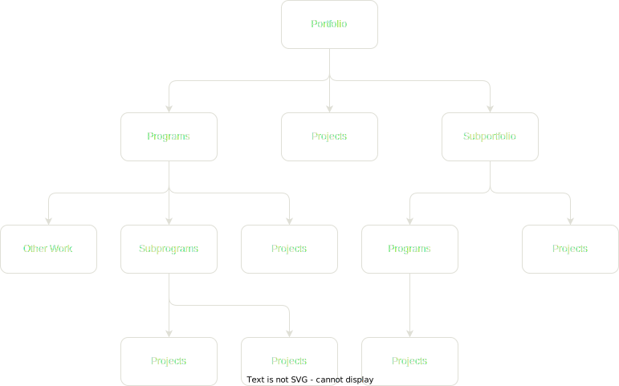

# Chapter 7 - Project Governance

## IT Projects

- Are complex
- Impact "whole business" projects
- Requiring inputs and resources from other areas than the IT department

### Project Failure

There are multiple reasons for project failure

- Only 16% of software projects were completed on time and on budget
- 31% of projects were cancelled before completion
- 53% of projects would cost over 189% of their original estimates

A Business-critical project should never be managed alone. A governance approach is essential!

## Project Management Office (PMO)

Department or group that defines and maintains the standards and processes related to project management within an organization

### Primary Function of a PMO

**Support Project Managers in:**

- Managing shared resources across all projects
- Identifying and developing project management methodology, best practices, and standards
- Coaching, mentoring, training, and oversight
- Monitoring compliance with project management standards, policies, procedures, and templates via project audits
- Developing and managing project policies, procedures, templates, and other shared documentation (organizational process assets)
- Coordinating communication across projects

## Project Management Frameworks

The two most widely recognised and used project frameworks

- Project Management Body of Knowledge (PMBOK®)
  - Developed by the Project Management Institute (PMI)
  - Standard terminology and guidelines for project management.
  - Recognized as an American National Standard (ANSI/PMI 99-001-2008) and by the Institute of Electrical and Electronics Engineers IEEE 1490-2011.
- Agile Project Management
  - Iterative method of determining projects requirements
  - Highly flexible and interactive
  - Requires interactions and collaboration from business, supplier and customer
  - Focus on Individuals and interactions
  - Respond to Continuity Changes rather than a Plan

## Scrum

A framework within which people can address complex adaptive problems, while productively and creatively delivering products of the highest possible value.

### Pillars of Scrum

- Transparency
- Inspection
- Adaptation

### Scrum is comprised by

- Teams
- Artifacts
- Events

## ISO 21500:2012 - Guidance on Project Management

Provides generic guidance, explains core principles and what constitutes good practice in project management

- Modeled on the Project Management Institute's Body of Knowledge (PMBoK)
- Introduces the project management processes, their inputs, and their outputs
- Since ISO 21500:2012 is a guidance document, it is not intended to be used for certification/registration purposes

| ISO 21500    | PMBOK® Guide               |
| ------------ | -------------------------- |
| Initiating   | Initiating                 |
| Planning     | Planning                   |
| Implementing | Executing                  |
| Controlling  | Monitoring and Controlling |
| Closing      | Closing                    |

## OPM3&reg; & PPM&reg; & PgM&reg;

### OPM3&reg; - Organisational Project Management Maturity Mode

Designed to help organizations determine their level of maturity in project management.

- It helps in the alignment and systematic management of Projects, Programs and Portfolios to achieve strategic organizational goals

### PPMPgM&reg; - Project Portfolio Management

A portfolio is a group of programs and/or projects to achieve a strategic business goal.

- The programs or projects may not be related other than the fact that they are helping to achieve that common strategic goal.
- The goal of portfolio management is to ensure that the organization is “doing the right work,” rather than “doing work right.”

### PgM&reg; - Program Management

The management of group of related projects in a coordinated way to obtain benefits and control not available from managing them individually

- It may provide decreased risk, economies of scale, and improved management that could not be achieved if the projects were not managed as parts of a program.

## Portfolio, Program and Project Management

### High Level View

### Cross-Company Portfolio Management Process Relationship

**INSERT DIAGRAM**
