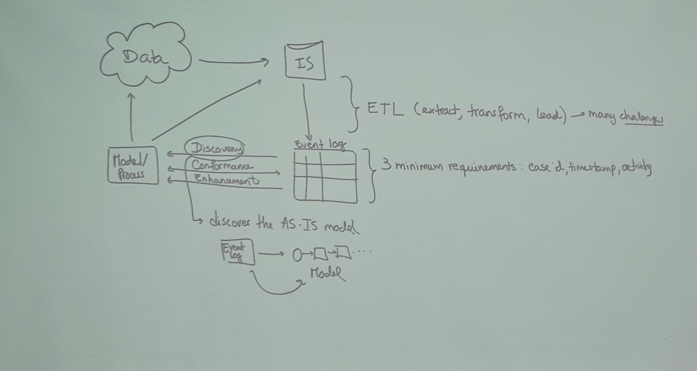

# Chapter 3 - ETL process

## Process mining

Has the goal of answering questions about the operational process but there is a problem!\
Data in the real world doesn't come from a single source, it's usually scattered, unstructured and there's usually data missing.

## What is ETL?

1. Extract data from outside sources
2. Transforming data into operational needs
3. Loading it into target system

**GOAL** of unifying data in such a way that it can be used and analyzed

## Event goals

A process consists of cases and cases consist of events.
Events within one case are ordered.

## Challenges that may arise

1. Challenge 1- Correlation\
Events in an event log are grouped per case, we require event correlation
2. Challenge 2- Timestamps\
Events need to be ordered per case, and usually events do not require timestamps but when merging data from different sources timestamps become quite useful
3. Challenge 3- Snapshots\
Cases mimght have a lifetime extending beyong the recorded period
4. Challenge 4- Scoping\
Enterprise information systems may have gigantic tables with relevant data but how to decide which ones to incorporate? Domain knowledge is required to locate data and scope it
5. Challenge 5- Granularity\
The events in the event log are at a different level of granularity than
the activities relevant to end users

## Data quality
