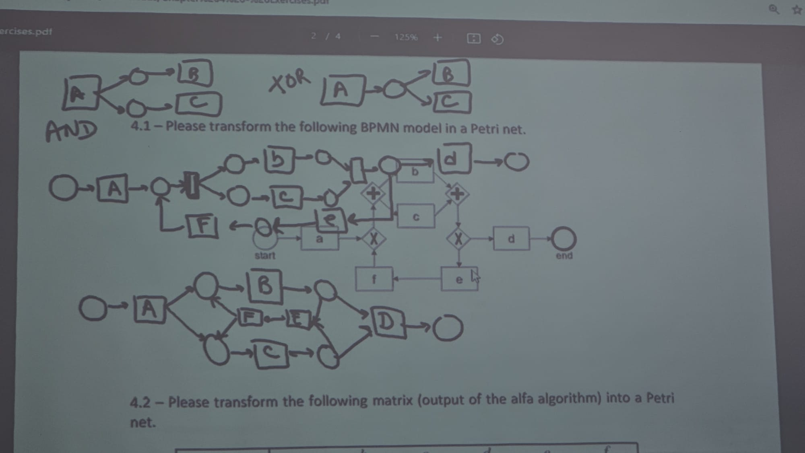

# Chapter 4 

A is followed by B, B is followed by D. 
XOR is there because the activity might end after D but sometimes it might loop back to B

exercicio de transformar um diagrama para um diagrama
