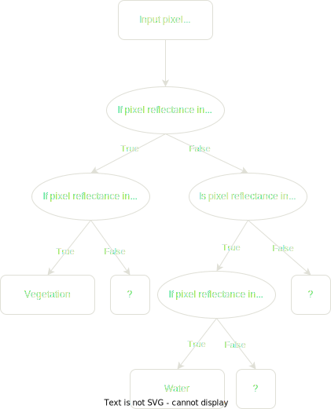

# Thematic Information Extraction from Satellite Images

## Definition of the mapping approach

optical data, no radar data

lclu (land cover, land use) maps

Spatial unit of analysis
pixel/object level

- Spatial resolution of the satellite image
- Type of thematic information we want to extract, e.g. land cover, land use
- Format of the map we want to produce vector/raster

### Raster Map Format

MMU = pixel size of input

1. feature selection
2. image classification
3. accuracy assessment

MMU > Pixel size of input

1. feature selection
2. image classification
3. post-processing (upscaling / generalization)
4. accuracy assessment

### Vector Map Format

???

## Geographical Stratification

Geographical stratification — the study area is divided into smaller areas (strata) so that each strata can be processed independently.

### Five general concepts are useful in geographical stratification

- Economics of size
- Type of physiography
- Potential land cover distribution
- Potential spectral uniformity
- Edge-matching issues

### Data that can be used for geographical stratification

- Slope
- Aspect
- Elevation
- Existent land cover/use maps
- Climate data
- Vegetation maps

## Image Segmentation

This step is only required if the spatial unit of analysis is the object.

Segmentation is the division of an image into spatially continuous, disjoint and homogeneous regions e.g. the objects

Segmentation of an image into a given number of regions is a problem with a large number of possible solutions

There are no " right" or "wrong" solutions to the delineation of landscape objects but instead meaningful" and "useful" heuristic approximations of partitions of space.

A type of segmentation that is very common is the multi-resolution segmentation, because of its ability to deal with the range of scales within a single image

## Feature Identification and Selection

What type of features can we use for information extraction?

Should we, for some reason, manipulate the feature space?

How can we select the best features for class discrimination?

Manipulation and selection of features are used to reduce the number of features without sacrificing accuracy

### Spectral Measurements - 1st order measurements

From a single date - Unitemporal approach
From multiple dates - Multi-temporal approach

### Secondary measurements derived from the image - 2nd order measurements

#### Measurements of the spatial unit being classified

Normalized Difference Vegetation Index (NDVI) is a widely used metric for quantifying the health and density of vegetation using sensor data. Ranges from -1 to 1

#### Measurements related to the neighbourhood (contextual information)

Most mapping approaches operate at a pixel level, ignoring its context

Contextual information and semantic relationship with neighbours is always used by photo-interpreters in visual analysis

Several attempts have been carried out to take into automatic classification the contextual information

- Texture
- First order statistics in the spatial domain
  - e.g. mean, variance, standard deviation, entropy
- Second order statistics in the spatial domain
  - e.g. homogeneity, dissimilarity, entropy, angular second moment, contrast, correlation
- Geostatistics
  - e.g., variogram, correlogram, covariance function
- Fractals

### Some considerations on object oriented image classification

In object oriented image classification one can use features that are very similar to the ones used on visual image interpretation

- Shape and size of the objects
- Spectral homogeneity within objects
- Semantic relationships of a spatial unit with its neighbours

Before object oriented image classification there was the per-field classification. In this approach the objects are not extracted from the satellite image through segmentation but instead from an existent geographical data base with landscape units, i.e. fields.

### Ancillary Information

- Continuous
  - Elevation, Slope, Aspect
  - Soil types, Existent land cover maps

## Classification

Allocation of a class to each pixel/spatial unit of analysis (SUA)

Each SUA is represented by a vector, consisting of a set of measurements (e.g. reflectance)

Definition of decision boundaries to separate classes

Definition of the decision rule (classifier e.g. Neural Network; Maximum Likelihood), i.e. the algorithm that defines the position of a SUA with respect to the decision boundaries and that allocates a specific label to that SUA

- Satellite Image Classification
- Natural Language Processing
- Syntactic Pattern Recognition
- Search Engines
- Medical Diagnosis
- Bioinformatics
- Cheminformatics
- Stock Market Analysis
- Classifying DNA Sequences
- Speech Recognition,
- Handwriting Recognition
- Object Recognition in Computer Vision
- Game Playing
- Robot Locomotion

### Type of Learning

#### Supervised

1. Training
2. Classify

#### Unsupervised

1. Clustering
2. Labeling

### Some considerations on the training stage

- The training phase is decisive on the final results of image classification- In fact, in these phase we collect the data that will be used to train the algorithm.
- The usual restrictions on sampling (cost, availability of data and accessibility) may lead to an inadequate sampling.
- In case of parametric classifiers the number of sample observations affect strongly the estimates of the statistical parameters.
- As the dimensionality of the data increases for a fixed sample size so the precision of the statistical parameters become lower (i.e., Hughes phenomenon).
- It is common that even mixed pixels dominate the image, only pure pixels are selected for training. However, this may lead to unsatisfactory classification accuracy.

### Assumption on Data Distribution

#### Parametric Classifiers

e.g. Maximum Likelihood Classifier

- Traditionally most classifiers have been grounded to a significant degree in statistical decision theory-
- These classifiers rely on assumptions of data distribution.
- The performance of a parametric classifier depends largely on how well the data match the pre-defined models and on the accuracy of the estimation of the model parameters.
- They suffer from the Hughes phenomenon (i.e. curse of dimensionality), and consequently it might be difficult to have a significant number of training pixels.
- They are not adequate to integrate ancillary data (due to difficulties on classifying data at different measurement scales and units).

#### Non-Parametric Classifiers

e.g. Decision Trees, Artificial Neural Networks, Support Vector Machines, Nearest Neighbour

##### Artificial Neural Networks

An ANN is a form of artificial intelligence that imitates some functions of the human brain.
An ANN consists of a series of layers, each containing a set of processing units (i.e. neurones)
All neurones on a given layers are linked by weighted connections to all neurones on the previous and subsequent layers
During the training phase, the ANN learns about the regularities present in the training data, and based on these regularities, constructs rules that can be extended to the unknown data

###### Most common types of ANN

- Multi-layer perceptron with back-propagation
- Self-organised feature map (SOM)
- Hopfield networks
- ART (Adaptive Resonance Theory) Systems

###### Advantages of ANN

- It is a non-parametric classifier, i.e. it does not require any assumption about the statistical distribution of the data
- High computation rate, achieved by their massive parallelism, resulting from a dense arrangement of interconnections (weights) and simple processors (neurones), which permits real-time processing of very large datasets

###### Disadvantages of ANN

- ANN are semantically poor. It is difficult to gain any understanding about how the result was achieved.
- The training of an ANN can be computationally demanding and slow.
- ANN are perceived to be difficult to apply successfully. It is difficult to select the type of network architecture, the initial values of parameters such as learning rate and momentum, the number of iterations required to train the network and the choice of initial weights.

##### Decision Trees

- DT are knowledge based (i.e. a method of pattern recognition that simulates the brains inference mechanism).
- DT are hierarchical rule based approaches.
- DT predict class membership by recursively partitioning a dataset into homogeneous subsets.
- Different variables and splits are then used to split the subsets into further subsets.
- There are hard and soft (fuzzy) DT.

###### Advantages of DT

- Ability to handle non-parametric training data, i.e. DT are not based on any assumption on training data distribution.
- DT can reveal nonlinear and hierarchical relationships between input variables and use these to predict class membership.
- DT yields a set of rules which are easy to interpret and suitable for deriving a physical understanding of the classification process.
- DT, unlike ANN, do not need an extensive design and training.
- Good computational efficiency.

###### Disadvantages of DT

- The use of hyperplane decision boundaries parallel to the feature axes may restrict their use in which classes are clearly distinguishable.

### Number of outputs for each spatial unit

#### Hard (Crisp) Classification

Each pixel is forced or constrained to show membership to a single class.

#### Soft (Fuzzy) Classification

Each pixel may display multiple and partial class membership.

Soft classification has been proposed in the literature as an alternative to hard classification because of its ability to deal with mixed pixels

### The Mixed Pixel Problem

The number of mixed pixels in an images varies mainly with:

- Landscape fragmentation
- Sensor's Spatial Resolution

#### Course Resolution

- Mixed pixels are mainly due to co-existence in the same pixel of different classes

#### Fine Resolution

- Mixed pixels are mainly due to co-existence in the same pixel of different components (e.g., houses, trees)

### How can we represent the sub-pixel information

Sub-pixel scale information is typically represented in the output of a soft classification by the _strength of membership a pixel displays to each class_.

It is used to reflect the relative proportion of the classes in the area represented by the pixel

### Soft Classifiers

#### Most common soft classifiers

- Maximum likelihood classification
- Fuzzy c-means
- Possibilistic c-means
- Fuzzy rule based classifications
- Artificial neural networks

## Ancillary Data Integration

Ancillary data can be integrated after image classification in order to improve the results

### Post-classification sorting

Application of very specific rules to classification results and to geographical ancillary data (e.g., elevation, slope, aspect)

There are several strategies based on expert systems, rule based systems and knowledge base systems
